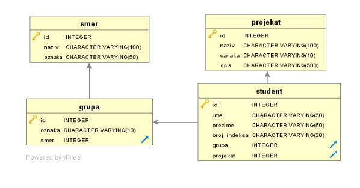
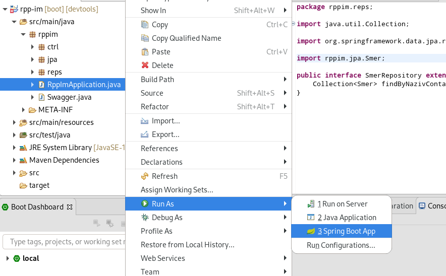

# Backend projekat

## REST API

API je interfejs, predstavlja neki sloj koji omogućava lakšu i standardizovanu
komunikaciju među aplikacijama. Definiše razne zehteve i pozive koji se mogu vršiti
da se dobije željeni rezultat.

REST API je posebna implementacija API-a.
Koristi se najčešće JSON format za komunikaciju između aplikacija.

Primer kako izgleda JSON:
```
{
	"ime":"Johnny",
	"prezime":"Depp"
}
```
## MVC Arhitektura
To je jedna od arhitektura koja se često koristi za izgradnju web aplikcije.
Model - View - Controller
View je korisnički interfejs, to jest ono što vidimo
Controller je ono iza u kodu šta ne vidimo i određuje šta će korisnik videti u zavisnosti od toga šta zahteva.

Na primer korisnik uđe na /login resurs, pa će kontroler prikazati korisniku 
formu za login itd

## Baza podataka
PostgreSQL je server za bazu podataka.
A SQL je samo standardizovani jezik koji se koristi za manipulisanjem
bazama podataka.
Primer: `SHOW * FROM student` će nam sve redove redove iz tabele student.

Imamo jednu bazu podataka i unutar nje četiri tabele: student, grupa, smer, projekat.


## Projekat fajl struktura i paketi
Glavni fajlovi i klase za projekat se nalaze unutar
*src/main/java* foldera. (neka te podseti "main" - glavno na eng.)

Unutar toga imamo *java* i *resource*
Java tu su razne klase, naš kod koji je pisan.
A za Resources su razni konfiguracioni fajlovi, skripte i razni resursi.

Imamo **ctrl**,**jpa**, **reps** pakete unutar glavnog **rppim**

**ctrl** - tu su svi kontroleri za naš projekat(Student, Grupa, Projekat, Smer)
**jpa** - služi za predstavljanje elementima u bazi podataka preko objekta/klasa
**reps** - dodatne funkcije za pretraživanje, npr po imenu

Primer:

**GrupaRestController** - unutar **ctrl** paketa, to je kontroler posvećen klasi Grupa, on služi za prihvatanje zahteva i odlučivanje šta će se desiti sa bazom podataa u našem slučaju. Na primer ako pošaljemo DELETE request
na `link/grupa/2` on će indirektno preko JPA i JDBC obrisati grupu koja ima `id = 2

## Pokretanje Aplikacije

Da se pokrene aplikacija uđe se na *src/main/java/rppim* 
i pored naših paketa imamo tu i RppImApplication
Desni klik, run as, i run as Spring Boot App



Treba sačekati malo dok se ne pokrene, pa onda uđemo na brauzer i ukucamo **localhost:8083**

I treba prikaže "Hello World!" tekst.

Da nam prikaže sve elemente u bazi podataka za tabelu student, uđemo na **localhost:8083/student**


`

## Requestovi

U kontrolerima prihvatamo razne zahteve:

**GET** - služi za dobijanje resursa od servera

**POST** - služi da pošaljemo nešto serveru

**PUT** - da izmenimo neku informaciju

**DELETE** - da obrišemo nešto(npr. korisnika iz baze podataka)
